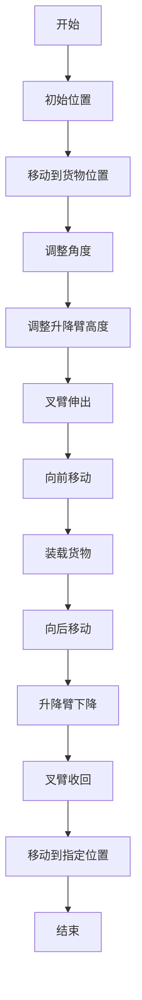

```mermaid
graph TD
    A[开始] --> B[初始位置]
    B --> C[移动到货物位置]
    C --> D[调整角度]
    D --> E[调整升降臂高度]
    E --> F[叉臂伸出]
    F --> G[向前移动]
    G --> H[装载货物]
    H --> I[向后移动]
    I --> J[升降臂下降]
    J --> K[叉臂收回]
    K --> L[移动到指定位置]
    L --> P[结束]
```