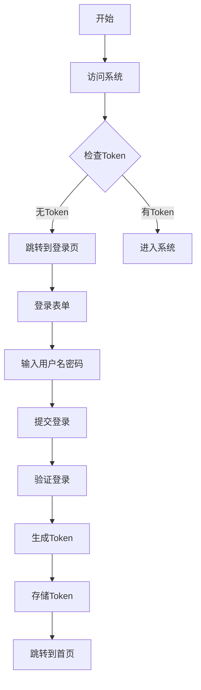

```mermaid
graph TD
    A[开始] --> B[访问系统]
    B --> C{检查Token}
    C -->|无Token| D[跳转到登录页]
    C -->|有Token| E[进入系统]
    
    D --> F[登录表单]
    F --> G[输入用户名密码]
    G --> H[提交登录]
    H --> I[验证登录]
    I --> J[生成Token]
    J --> K[存储Token]
    K --> L[跳转到首页]
```