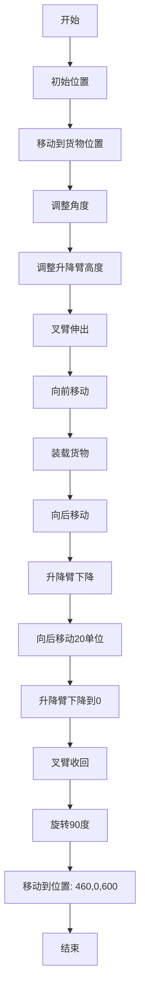

```mermaid
graph TD
    A[开始] --> B[初始位置]
    B --> C[移动到货物位置]
    C --> D[调整角度]
    D --> E[调整升降臂高度]
    E --> F[叉臂伸出]
    F --> G[向前移动]
    G --> H[装载货物]
    H --> I[向后移动]
    I --> J[升降臂下降]
    J --> K[向后移动20单位]
    K --> L[升降臂下降到0]
    L --> M[叉臂收回]
    M --> N[旋转90度]
    N --> O[移动到位置: 460,0,600]
    O --> P[结束]
```