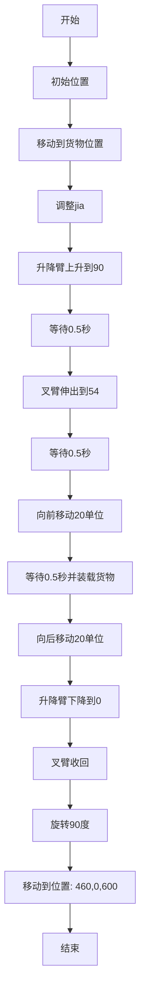

```mermaid
graph TD
    A[开始] --> B[初始位置]
    B --> C[移动到货物位置]
    C --> D[调整jia]
    D --> E[升降臂上升到90]
    E --> F[等待0.5秒]
    F --> G[叉臂伸出到54]
    G --> H[等待0.5秒]
    H --> I[向前移动20单位]
    I --> J[等待0.5秒并装载货物]
    J --> K[向后移动20单位]
    K --> L[升降臂下降到0]
    L --> M[叉臂收回]
    M --> N[旋转90度]
    N --> O[移动到位置: 460,0,600]
    O --> P[结束]
```