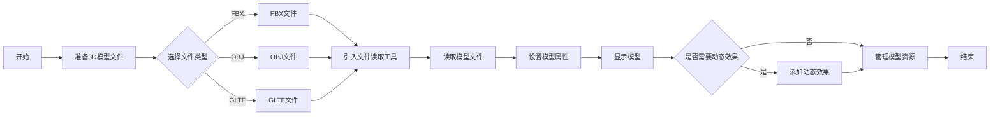

```mermaid
graph LR
    A[开始] --> B[准备3D模型文件]
    B --> C{选择文件类型}
    C -->|FBX| D1[FBX文件]
    C -->|OBJ| D2[OBJ文件]
    C -->|GLTF| D3[GLTF文件]
    
    D1 --> E[引入文件读取工具]
    D2 --> E
    D3 --> E
    
    E --> F[读取模型文件]
    F --> G[设置模型属性]
    G --> H[显示模型]
    H --> I{是否需要动态效果}
    I -->|是| J[添加动态效果]
    I -->|否| K[管理模型资源]
    
    J --> K
    K --> L[结束]
```