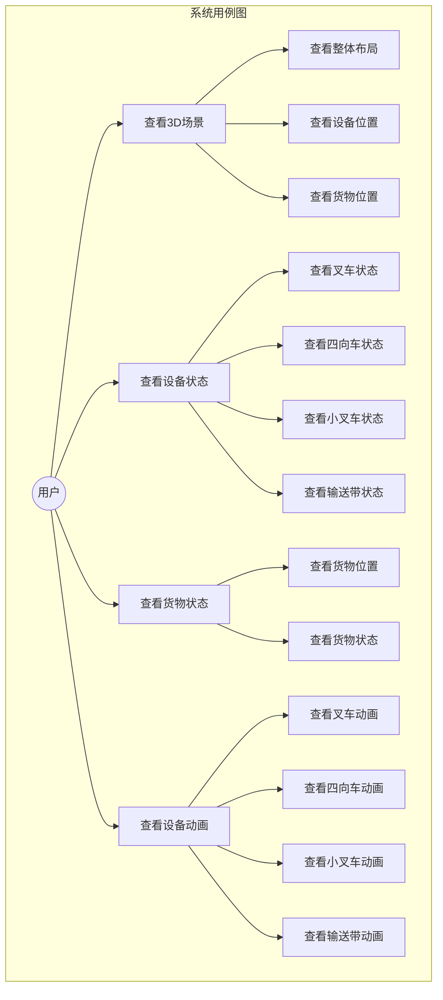

```mermaid
graph TB
    subgraph 系统用例图
    direction LR
    A((用户)) --> B[查看3D场景]
    A --> C[查看设备状态]
    A --> D[查看货物状态]
    A --> E[查看设备动画]
    
    B --> B1[查看整体布局]
    B --> B2[查看设备位置]
    B --> B3[查看货物位置]
    
    C --> C1[查看叉车状态]
    C --> C2[查看四向车状态]
    C --> C3[查看小叉车状态]
    C --> C4[查看输送带状态]
    
    D --> D1[查看货物位置]
    D --> D2[查看货物状态]
    
    E --> E1[查看叉车动画]
    E --> E2[查看四向车动画]
    E --> E3[查看小叉车动画]
    E --> E4[查看输送带动画]
    end  
```